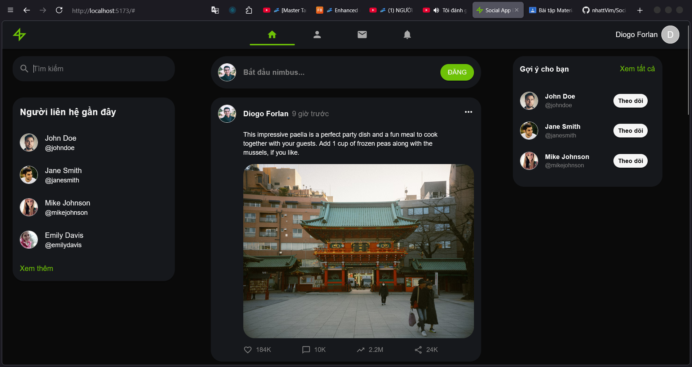
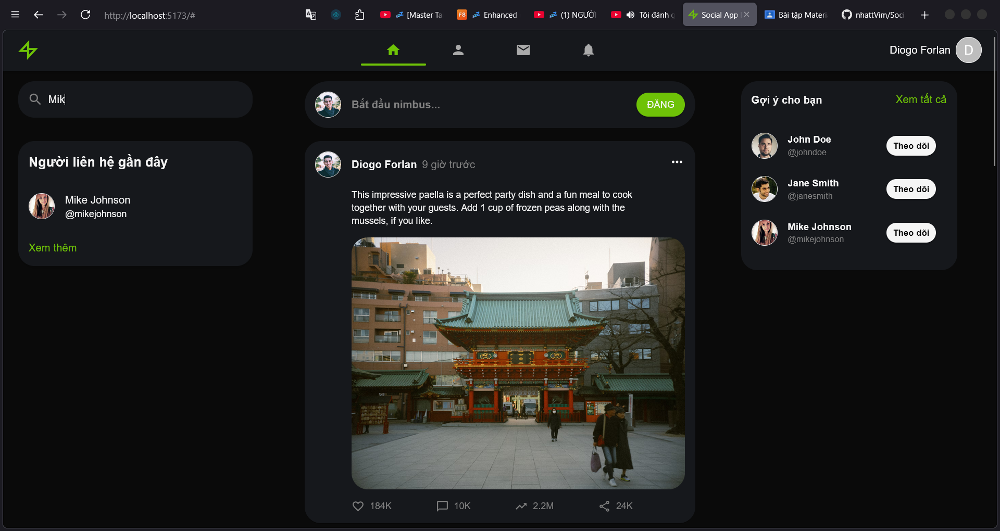
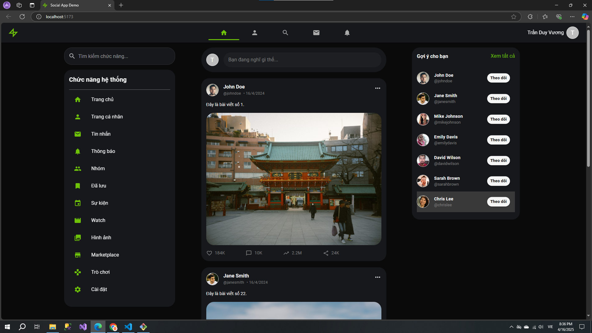
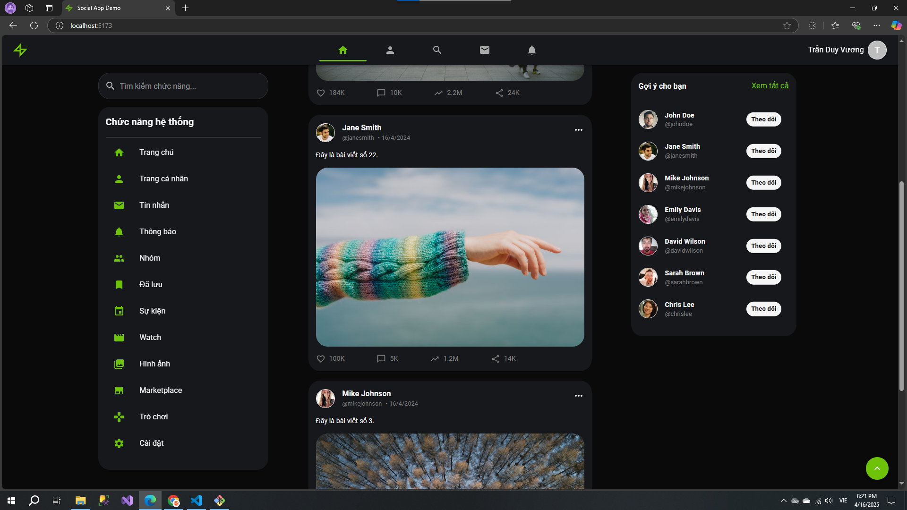
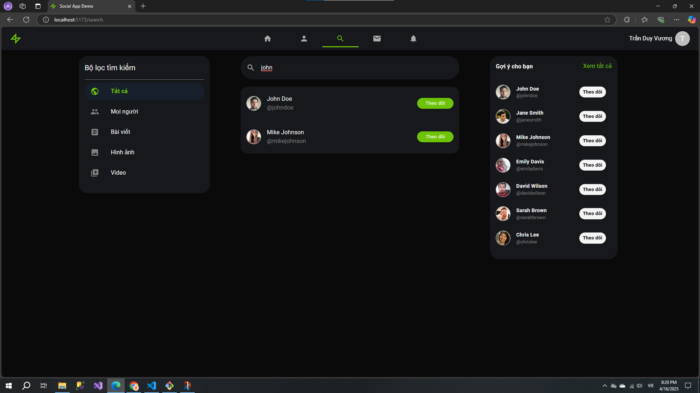

# Social Media App with React & Material-UI

## 🚀 Cách dùng

```bash
# Tải dự án về
git clone https://github.com/Vuong1411/React-MUI.git
cd Social.App.Demo

# Nếu dùng yarn
yarn
yarn dev

# Nếu dùng npm
npm i
npm run dev
```

## 🛠️ Công nghệ sử dụng

- [React](https://reactjs.org/) - Frontend framework
- [Material-UI](https://mui.com/) - Thư viện UI components
- [React Router](https://reactrouter.com/) - Điều hướng trang
- [Vite](https://vitejs.dev/) - Build tool

## ✨ Tính năng

- 🌙 Giao diện tối (Dark theme)
- 🔍 Tìm kiếm người dùng
- 📱 Responsive trên mọi thiết bị
- 💬 Tạo và tương tác với bài viết
- 👥 Hệ thống theo dõi người dùng
- 🎨 Sử dụng Material-UI components

## 📸 Screenshot

### Giao diện ban đầu





### Giao diện sau khi chỉnh sửa





### Giao diện trang tìm kiếm



## 📦 Cấu trúc thư mục

```
src/
  ├── components/     # React components
  ├── data/          # Mock data và constants
  ├── layout/        # Layout components
  ├── pages/         # Page components
  └── types/         # TypeScript types
```

## 👨‍💻 Tác giả

**Trần Duy Vương**
- GitHub: [@Vuong1411](https://github.com/Vuong1411)

## 📄 License

[MIT License](LICENSE)